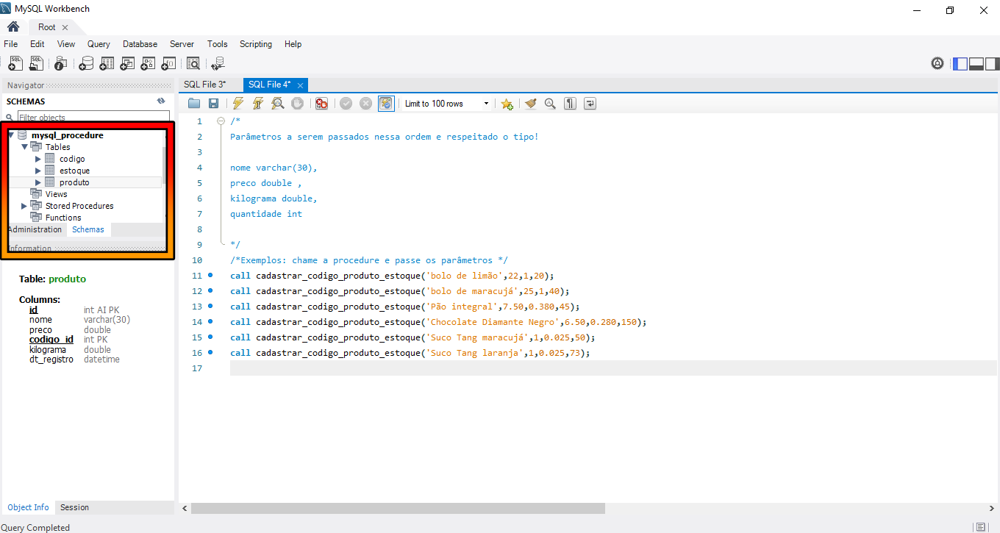
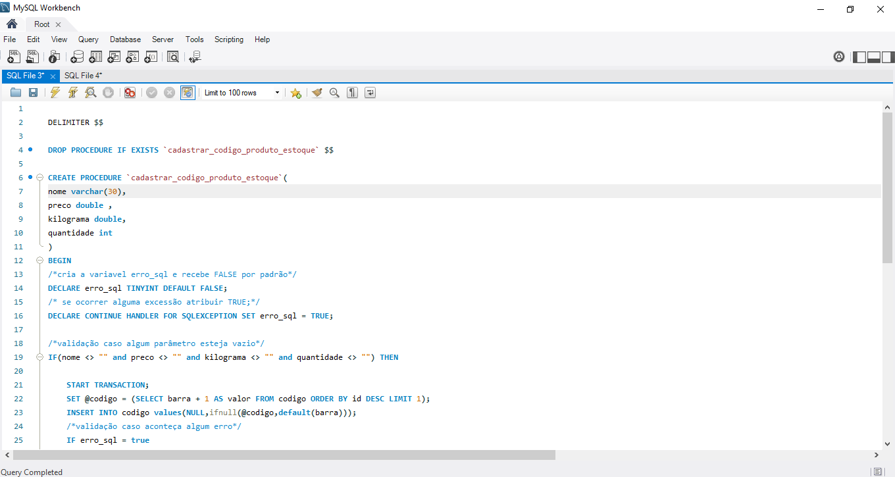
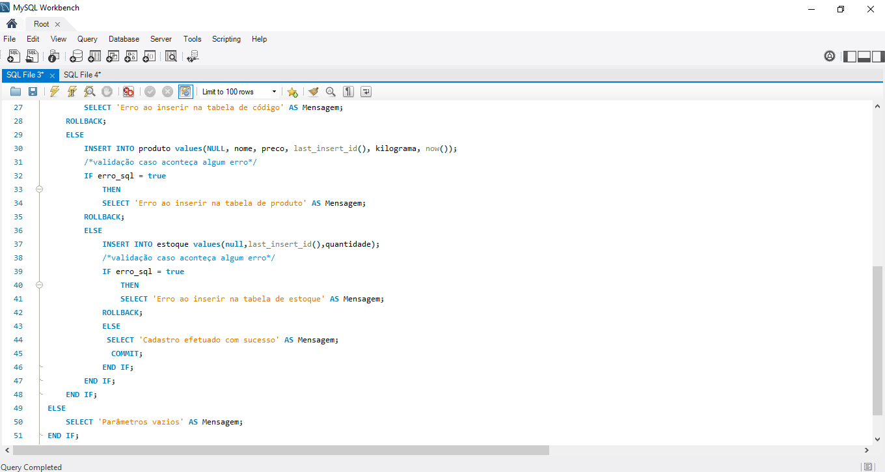
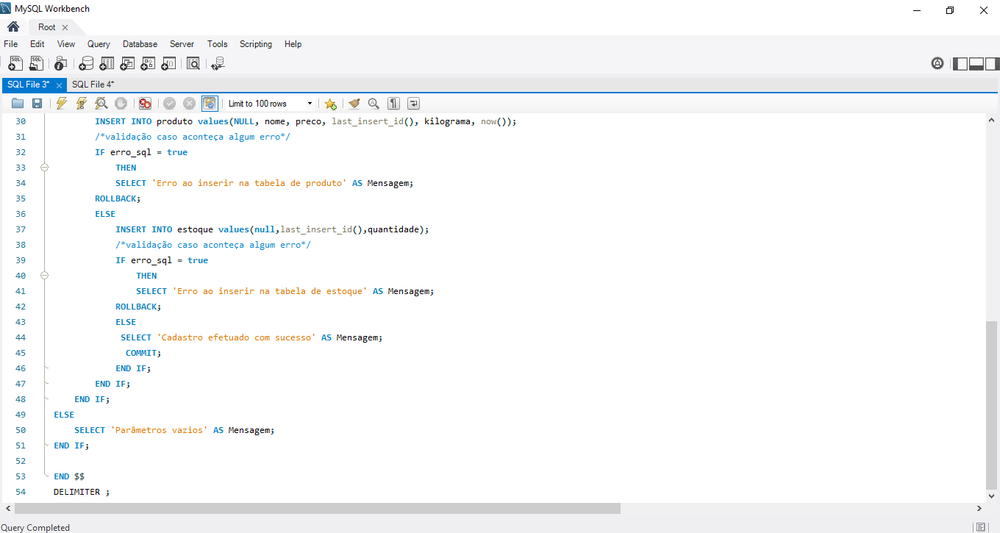
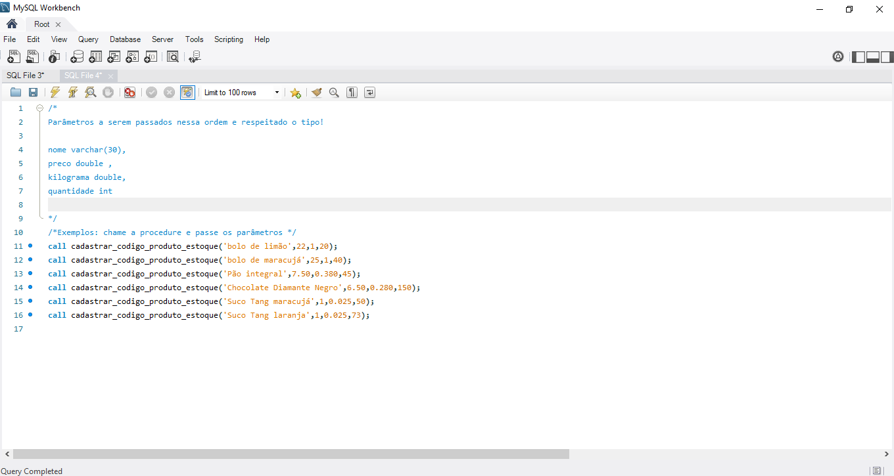

# Procedure Mysql 

## Este é um exemplo de uma stored procedure criada para cadastrar em diferentes tabelas de forma simultânea.

### :camera: Veja como foi implementado essa procedure: :+1:

### :one: Imagem das tabelas do banco de dados mysql_procedure, o arquivo da criação do banco de dados está disponível <a href="https://github.com/Akiolucas/mysql_procedure/blob/main/mysql_procedure_bd.sql">Aqui:boom: </a> 

### :two: Imagens do código da procedure, o arquivo da criação da procedure está disponível <a href="https://github.com/Akiolucas/mysql_procedure/blob/main/procedure_cadastrar_codigo_produto_estoque.sql"> Aqui:boom: </a>:

 ### :camera: Parte 2:

### :camera: Parte 3:

### :three: Imagem mostrando como chamar a procedure, o arquivo de chamada da procedure está disponível <a href="https://github.com/Akiolucas/mysql_procedure/blob/main/chamar-procedure.sql"> Aqui:boom:</a>:

### Fim :sunglasses: :+1:

